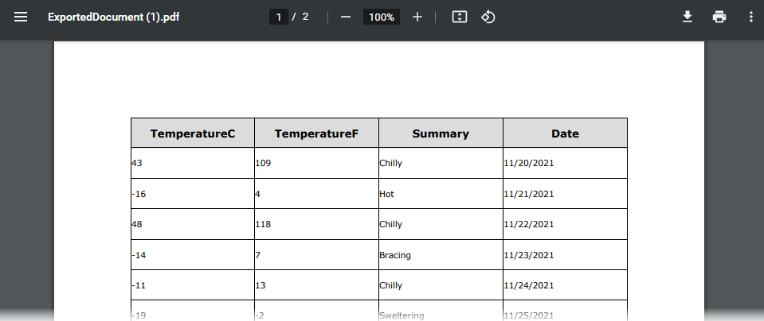

<!-- default badges list -->

<!-- default badges end -->

# Grid for Blazor - How to use DevExpress Reporting tools to implement export in a server application

The [Grid](https://docs.devexpress.com/Blazor/403143/grid) component allows you to [export data](https://demos.devexpress.com/blazor/Grid/Export/DataAwareExport) to XLS, XLSX, and CSV file formats. You can also use DevExpress Reporting tools to implement export to different formats (PDF, XLSX, and DOCX). This example illustrates how to do this in a Blazor Server application.

To export information, apply the [ExportMiddleware](./CS/DxDataGridExportingWithReports/Helpers/ExportMiddleware.cs) type to the application request pipeline. The **ExportMiddleware** handles requests. The response returns the file of the corresponding type.

The [ExportButtons](./CS/DxDataGridExportingWithReports/Shared/ExportButtons.razor) component contains export buttons. Each export button contains an [URI to this project](./CS/DxDataGridExportingWithReports/Pages/Index.razor#L32), and the URI contains the Data Grid options. The created report contains only data that is visible in the grid after sort and filter operations. The **ExportMiddleware** processes the request with the URI.

Use the [ReportHelper.CreateReport](./CS/DxDataGridExportingWithReports/Helpers/ReportHelper.cs#L9) method with the [ExportToPdf(String)](https://docs.devexpress.com/XtraReports/DevExpress.XtraReports.UI.XtraReport.ExportToPdf(System.String-DevExpress.XtraPrinting.PdfExportOptions))/[ExportToXlsx(Stream)](https://docs.devexpress.com/XtraReports/DevExpress.XtraReports.UI.XtraReport.ExportToXls(System.IO.Stream-DevExpress.XtraPrinting.XlsExportOptions))/[ExportToDocx(Stream)](https://docs.devexpress.com/XtraReports/DevExpress.XtraReports.UI.XtraReport.ExportToDocx(System.IO.Stream-DevExpress.XtraPrinting.DocxExportOptions)) methods to create a report that is exported to the file of the corresponding type.

<!-- default file list -->

## Files to look at

* [Index.razor](./CS/DxDataGridExportingWithReports/Pages/Index.razor)
* [ExportMiddleware.cs](./CS/DxDataGridExportingWithReports/Helpers/ExportMiddleware.cs)
* [ReportHelper.cs](./CS/DxDataGridExportingWithReports/Helpers/ReportHelper.cs)
* [ExportButtons.razor](./CS/DxDataGridExportingWithReports/Shared/ExportButtons.razor)

<!-- default file list -->

## Documentation and Demos

* [XtraReport](https://docs.devexpress.com/XtraReports/DevExpress.XtraReports.UI.XtraReport)
* [Grid - Export Data](https://demos.devexpress.com/blazor/Grid/Export/DataAwareExport)

## More Examples

[DataGrid for Blazor - How to use DevExpress Reporting tools to implement export in a WASM application](https://github.com/DevExpress-Examples/blazor-webassembly-dxdatagrid-export)

[How to use DevExpress Reporting Components in Blazor applications](https://github.com/DevExpress-Examples/how-to-use-reporting-components-in-blazor-applications)
